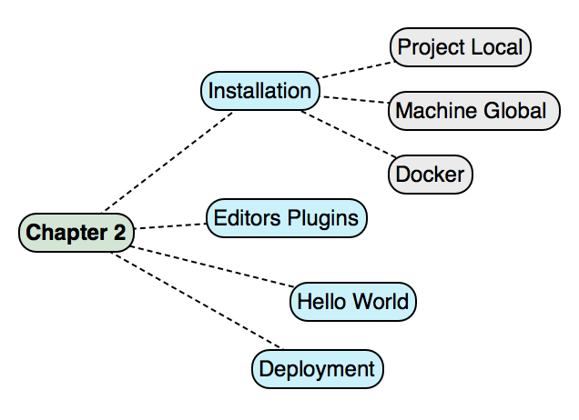
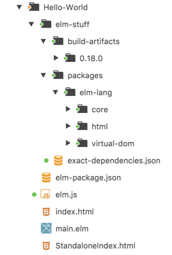
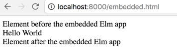

[ToC](https://github.com/kujua/webapplications-with-elm-beta-access/blob/master/Readme.md)

# *Chapter 2 - Getting Started*

In *Chapter 1* we have seen examples of Elm applications and also had a glimpse into what can be achieved with the Elm platform. Those examples either used Elm on its own or integrated Elm with JavaScript libraries and frameworks.


Our goal is to be able to develop applications like the ones featured. Before we can enjoy the fun of doing this we first have to invest some time to learn the basics of the Elm platform.


*Chapters 2* to *5* of this book give a comprehensive introduction to the Elm platform on which we can build for the rest of the book. The content in these chapters tries to go from basic information to more advanced topics. The chapters can be read in isolation, but I recommend to read them in sequence, because they build on each other.


In this chapter we will look at the following topics:





Figure 2-1. Chapter Overview


The topics describe the tasks we need to have a computer ready to write Elm applications:


1. Install the Elm platform.
1. Decide on an editor and install a plugin for the Elm language.
1. Get a first look at the Elm language.
1. Decide how to deploy an Elm application.
1. Organize the source code of an application for easier development.


In this chapter we just handle the basics, advanced topics like continuous deployment or continuous delivery and tools for testing and debugging will be touched in *Chapter 4*.


# Installation


We have to install the Elm platform to get started with our development. This does not mean that we have to install a runtime as in other systems like *Java* or *.Net*. The Elm platform is self-contained without runtime dependencies. Of course, since Elm compiles to JavaScript we will need a browser and a JavaScript engine to run the compiled Elm application.


To use the Elm platform, we just have to get the tools onto our computer to compile Elm code, install packages our code depends on and run the compiled code in a development server.


**Note** The Elm platform supports all *modern* browsers. It seems that there is no known lower bounds for Chrome, Firefox, Opera or Safari, also helped by the effective update process of these browsers which keeps the browsers and JavaScript engines 0n the latest version. Internet Explorer before version 9 does not work, but can't be considered *modern* as well.


The *Elm guide*^[https://guide.elm-lang.org/get_started.html] provides links to installers for Mac OS and Windows. Alternatively, it is possible to install the platform with *npm*. Node is a pre-requisite to work with tools of the Elm platform and *npm*^[https://docs.npmjs.com/] is installed together with *Node*^[https://nodejs.org/en/download/] which itself has several installation options on all major platforms. Most probably readers of this book have Node installed anyway.


The installation with *npm* is an operating system independent way and is valid for MaxOS, Windows and Linux. We will focus on this option in this book.


**Note** Make sure that the node installation does not need elevated administrator rights  to run (*su/sudo* on Mac or Linux), otherwise you will get errors when running Elm platform tools.


Once *npm* is on the computer and verified to work we can install the Elm platform, either locally in a project or globally on the development computer. If we don't want to install the Elm platform on the physical machine at all we can use a Docker image.


**Tip** Another package manager is *yarn*^[https://yarnpkg.com/] that works with *npm* and other package formats and has some advanced features compared to *npm*. Some example projects in the downloadable source code are using *yarn*, but throughout the book we will use only *npm*.


## Global Installation


A global installation of the Elm platform can be done with the above mentioned installers which you can download from the Elm website, but as mentioned before we are focusing on *npm*.  The following shell command installs the Elm platform:


###### Listing 2.1 Install Elm with npm


```{.numberLines}
$ npm install -g elm

```


The option *-g* tells *npm* to install the package globally. The Elm package we download from the *npm* repository is created during the publishing process of the Elm platform, so it will be up-to-date with the latest stable version and it will have the same version as the operating system specific installers.


After running the *npm* installation we can then check if the Elm platform is setup by simply running the command *elm* on the command line:


###### Listing 2.2 Run Elm


```{.numberLines}
$ elm
Elm Platform 0.18.0 - a way to run all Elm tools

Usage: elm <command> [<args>]

Available commands include:
  make      Compile an Elm file or project into JS or HTML
  package   Manage packages from <http://package.elm-lang.org>
  reactor   Develop with compile-on-refresh and time-travel debugging
  repl      A REPL for running individual expressions

```


The output of the command in the above listing has lines omitted for brevity, but we can see the most important information. The installed version of the Elm platform provides four commands. We will use all these commands in the following chapters, so we won't explain them in detail now. At this moment we just wanted to make sure that the Elm platform is installed and can be run.


The caveat is that running the command *elm* does not prove that the Elm platform tools are actually working. The basic *elm* command calls other tools to do its tasks, so we need at least call one of the other tools to make sure.


We can test our installation by calling the tool *elm-repl* from the command line. You can use either *elm repl* or *elm-repl*. The *elm command with option *repl* is calling the program with the dash in it.


###### Listing 2.3 Run elm-repl


```{.numberLines}
$ elm-repl
---- elm-repl 0.18.0 -----------------------------------------------------------
 :help for help, :exit to exit, more at <https://github.com/elm-lang/elm-repl>
--------------------------------------------------------------------------------
> _

```


If you see an output similar to above - your version number may be different - then your installation of the Elm platform was successful.


 **Tip** On some Linux systems you may get an error when running *elm-repl*. Most likely this has to do with a missing dependency called *libtinfo* which needs to be installed manually from the Linux distribution repository. On all systems the installed version of Node may not be the latest. If you get error about "Haskell sandbox" or similar, upgrade to the latest Node version. For Elm version *0.18.x* I have successfully used Node version *6.9.x* and *7.x*.


With the installation finished and at least partially validated we have now the Elm platform available on our computer. Since this is a global installation we can run the command *elm* and the Elm platform tools from a command line in any directory on our computer.


## Local Installation


The global installation of the Elm platform has advantages, but it is not always the desired solution. Often there is a need to install the Elm platform locally in a project. The platform is evolving rapidly and changes from one version to the next version may break the code of an existing application.


My own setup is to have the latest version globally installed, for example the latest development version. For other projects I can then use a local version of the Elm platform or a Docker container.


 **Caution** If you use the installers from the Elm website, the Elm platform will always be installed globally.


In order to install the Elm platform in the directory of an Elm project we can run the following command which is similar to the global installation but without the *-g* flag:


###### Listing 2.4 Install Elm in a Project


```{.numberLines}
npm install --save elm

```


This will install the Elm platform in the default directory for node packages named *node_modules* in the directory we ran the above command from. The directory *node_modules* will be created automatically if it does not exist, but you must have a file *package.json* with at least an empty root level (*{}*), otherwise *npm* fails with an error. The section *dependencies* will be updated with the Elm package dependency.


Instead of having the Elm platform as normal dependency, it is better to indicate that it is only needed for development.


###### Listing 2.5 Install Elm as dev dependency


```{.numberLines}
npm install --save-dev elm

```


The above command will add Elm to the section *devDependencies*. This is only important if the project source code is installed by other developers who do not want to have a local Elm version, because their global version is correct. They can then use <span custom-style="Code Inline">npm install -production</span> to install only normal project dependencies.


**Tip** The package manager *yarn* not only installs a package without a file *package.json* already created in the installation directory, but also creates this file and adds a dependency section with the installed Elm package as dependency automatically. The packages are installed as usual in the directory *node_modules*.


A local installation is not without problems if we also have a global Elm installation. For example, we can't type simply *elm*, because this would run the global version. We have to use the correct path for the desired Elm version. To make us type less we can define scripts in *package.json*:


###### Listing 2.6 Scripts in package.json


```{.json .numberLines}
"scripts": {
  "c": "node_modules/.bin/elm make src/main.elm --output elm.js",
  "cw": "node_modules/.bin/elm make src/main.elm --output elm.js --warn",
  "r": "node_modules/.bin/elm repl"
}

```


With these few lines added we can now invoke the command <span custom-style="Code Inline">npm run c</span> and it will compile the file *main.elm* using the local Elm version. Similarly,  <span custom-style="Code Inline">npm run cw</span> will write out warnings when compiling and <span custom-style="Code Inline">npm run r</span> will open *elm-repl*. These options will become clearer when we discuss compilation and deployment of our projects later in this chapter.


# Running a Docker container


If we don't want to install the Elm platform on our computers, we could run a Docker container. The Docker system needs to be installed, but there are easy installation options for MacOS^[https://docs.docker.com/engine/installation/mac/], Windows^[https://docs.docker.com/engine/installation/windows/] and Linux distributions, for example Ubuntu^[https://docs.docker.com/engine/installation/linux/ubuntulinux/]. The new installers for MacOS and Windows have the advantage that no additional virtual machine environment like *VirtualBox* needs to be installed and run. The needed virtual machines are included in the Docker installation.


On *Docker Hub* several Elm containers can be found^[https://hub.docker.com/search/?i&page=1&q=elm]. They can easily be downloaded and installed into the Docker system, but many developers like to have more control and want to create their own container configurations. The following listing shows a simple *Dockerfile* that creates a Docker image that runs the Elm platform:


###### Listing 2.7 Dockerfile Elm Image


```{.docker .numberLines}
FROM haskell:7.10.2
MAINTAINER Wolfgang Loder <wolfgang.loder@googlemail.com>
ENV ELM_VER=master

RUN apt-get update && apt-get install -y \
   curl \
   git \
   libtinfo-dev \
   nodejs
ENV PATH /opt/Elm-Platform/$ELM_VER/.cabal-sandbox/bin:$PATH
WORKDIR /opt
RUN curl https://raw.githubusercontent.com/elm-lang/elm-platform/master/installers/BuildFromSource.hs > BuildFromSource.hs
RUN runhaskell BuildFromSource.hs $ELM_VER
EXPOSE 8000 8000
ENTRYPOINT ["elm"]

```


This image is based on the official Haskell image and builds the Elm platform, which is written in Haskell, from source code. The source can be found on GitHub^[https://github.com/elm-lang/elm-platform] and in this example we use the master branch which is the latest version. It is also possible to define a specific version by supplying a tag like *0.17.0*.


**Note** For current Elm versions the supported Haskell version is *7.10.2* which is not the latest version. If you installed a Haskell image in your Docker system before, it may be an incorrect version. So don't be surprised if the above Docker command downloads a nearly 1 GB big file during the creation of the Elm platform image.


Having a working Docker installation on our computer we can create our image. First we need to open a command-line interface in the directory where our Dockerfile is saved. Then we can run the following command which will pickup the Dockerfile in the current directory - note the *dot* argument to indicate the directory:


###### Listing 2.8 Create Docker Container


```{.numberLines}
docker build -t elmexposed:1.0 .

```


A new image called *elmexposed* with the tag *1.0* will be created. The name hints at the fact that it can be used like a global installation of the Elm platform, but it is not interactive in the sense that it provides a bash prompt.


The best way is to set an alias in the CLI with the *docker run* command to be able to invoke Elm commands in the container. Another important startup option is to set a working directory on our machine to bind it to the container as well. In addition we will expose a port from the container, so we can test the Elm application. The following - formatted for readability - command sets the alias:


###### Listing 2.9 Run Docker Image


```{.numberLines}
alias elmex='docker run
  -it
  -v $(pwd):/Hello-World
  -w /Hello-World
  -p 8000:8000
  -e "HOME=/tmp"
  --rm elmexposed:1.0'

```


We call the alias *elmex* so it does not interfere with the Elm installation on our computer.  The directory of our example *Hello-world* is bound to the container and is used as the working directory. For this to work we have to run the command in the *Hello-world* directory to set *pwd* to the correct value.


When we run *elm reactor*, Docker will forward every response on port 8000 in the container to port 8000 on our computer which hosts the container. Vice versa, all requests on port 8000 on our computer will be forwarded to the container. In a browser we will see the expected *Hello World* string displayed as if we were running *elm-reactor* on our physical computer.


It seems a little bit complicated to build the Elm platform from scratch when creating our *elmexposed* Docker image. Not only does it take some time, but the image itself is quite big.


There is another way to expose Elm by creating a Docker image via a *npm* installation as we discussed it before:


###### Listing 2.10 Dockerfile - Elm installation with npm


```{.docker .numberLines}
FROM ubuntu:latest
MAINTAINER Wolfgang Loder <wolfgang.loder@googlemail.com>

RUN apt-get update && apt-get install -y \
   apt-utils \
   curl \
   git \
   libtinfo-dev \
   build-essential
RUN curl -sL https://deb.nodesource.com/setup_7.x | sudo -E bash -
RUN sudo apt-get install -y nodejs
RUN npm install -g elm
EXPOSE 8000 8000

```


This configuration uses the latest official Ubuntu system, installs *Node* and after that the package *elm* is installed with *npm* with the same command we discussed before. It also exposes port 8000 from the container.


As before we create the image with *docker build* and give our image the name *elminteractive*:


###### Listing 2.11 Dockerfile - Elm installation with npm


```{ .numberLines}
docker build -t elminteractive:1.0 .

```


The difference to *elmexposed* is that we can create an interactive container with this image and get a bash prompt.


###### Listing 2.12 Interactive Docker Elm Container


```{.numberLines}
docker run -it elminteractive:1.0

```


Now we can run any valid command on the  Ubuntu system container, for example *elm --version* to see if the Elm platform was successfully installed.


We can also create a container that is attached to a directory on our computer and use the Elm platform as if it were installed on our physical computer. The following listing shows a bash session compiling the *Hello-World* example.


###### Listing 2.13 Interactive Docker Elm Container with local directory


```{.numberLines}
$ docker run -it -p 8000:8000 -v $(pwd):/Hello-World elminteractive:1.0

root@30bf0211b4fd:/# ls
  Hello-World  bin  boot  dev  etc  home  lib  lib64  media  mnt  opt  proc
  root  run  sbin  srv  sys  tmp  usr  var
root@30bf0211b4fd:/# cd Hello-World
root@30bf0211b4fd:/Hello-World# ls
  StandaloneIndex.html  elm-package.json  elm-stuff  elm.js  helloworld.html
  helloworld.js  index.html  main.elm
root@30bf0211b4fd:/Hello-World# elm make main.elm --output helloworld.js
  Success! Compiled 37 modules.
  Successfully generated helloworld.js
root@30bf0211b4fd:/Hello-World# elm reactor -a 0.0.0.0
  elm-reactor 0.17.1
  Listening on http://0.0.0.0:8000/
^C
  Shutting down...
root@30bf0211b4fd:/Hello-World# exit
$ _

```


After running the *docker run* command in the *Hello-World* directory of our computer with the above options we get a bash prompt. With *ls* we list the directories and see that the *Hello-World* directory is available. Changing the directory into it and listing the files we see all the files and directories right in the container bash prompt.


The next step is to compile *main.elm* with the usual make command. Then we run *elm-reactor*. The option *-a* sets the server address. This may not be necessary, but especially MacOS I used does not recognize *localhost* when ports are exposed from a Docker container. This is why we set the address to *0.0.0.0*. The port is the default port 8000 we have exposed in the Dockerfile.


On our computer we run *http://0.0.0.0:8000/Hello-World/index.html* and get the string "Hello World" rendered.


By creating Docker images and containers we can have several Elm platform versions on our computer without having to install anything globally or in a project. It is up to the developer which option is preferred. At the end they all lead to the Elm platform available for development.


# Editors and IDEs


No matter which option we choose to install the Elm platform, we will need an editor or an IDE to write code.


Developers working with *Java Virtual Machine*- or *.Net*-languages are used to IDEs with extensive support for various development tasks:


* Intellisense
* Auto-completion
* Refactoring like changing symbol names
* Jumping to definitions and symbols
* Formatting code
* Debugging support
* Integration of tools


Newer languages like Elixir or Elm do not have the luxury of a full blown IDE, but there are plugins for editors available that achieve some of the tasks listed above. The following paragraphs list some of the most popular editors and their plugin options.


**Tip** Before installing a plugin you should check if it can handle the Elm platform version you are running.


The following list is in alphabetical order, not in order of preference.


### Atom


There are quite a few plugins available for Atom that target the Elm platform. The one listed here incorporates other plugins for a complete experience.


* Plugin Name: *Elmjutsu*
* Link: *atom.io/packages/elmjutsu*
* Features: Syntax Highlighting, Autocomplete, Go To (Definition, Symbol, Usage), Rename (Symbol)
* Comments: This plugin helps with writing code only, it does not have an integration with the Elm platform tools.


### Emacs


The listed plugin is the only one at the moment supporting Elm. There is a *FlyCheck* support for Elm available (github.com/bsermons/flycheck-elm), but it was not updated for a while, so does not support the latest language version at the time of writing.


* Plugin Name: *elm-mode*
* Link: *github.com/jcollard/elm-mode*
* Features: Syntax Highlighting, Autocomplete (via elm-oracle and company), Intelligent Indentation, Integration with Elm platform tools and elm-format


### IntelliJ


The plugin works with IntelliJ Community Edition and other IDEs.


* Plugin Name: *elm-plugin*
* Link: *plugins.jetbrains.com/plugin/8192*
* Features: Syntax Highlighting, Autocomplete, Syntax Parser, Go To (Declaration), Rename refactoring, Brace Matching, Highlighting unresolved references, Spellchecking


### LightTable


LightTable is an editor that is not as often used as almost all the others in this list, but the plugin described here is one of the best I have experienced.


* Plugin Name: *elm-light*
* Link: *github.com/rundis/elm-light*
* Features: Syntax Highlighting, Autocomplete, Linting and for some errors, Inline Docs, Find Usages, Module Browser, Go To (Definition), Integration with elm-repo, elm-reactor and elm-format
* Comments: Extensive manual on rundis.gitbooks.io/elm-light-guide/content/.


### Sublime


The plugin is compatible with sublime 2 and 3.


* Plugin Name: *Elm Package Support*
* Link: *packagecontrol.io/packages/Elm%20Language%20Support*
* Features: Syntax Highlighting, Autocomplete, Integration with elm-repl, elm-make.
* Comments: The integration with elm-repo needs the installation of another plugin: Sublime​REPL


### Vim


The plugin has very good integration with the Elm platform tools and includes an option to run unit tests from within the editor.


* Plugin Name: *elm-vim*
* Link: *github.com/ElmCast/elm-vim*
* Features: Syntax Highlighting, Autocomplete, Automatic Indentation, Linting, Integration with elm-repl, elm-make, elm-format and elm-test.


### Visual Studio Code


The plugin is under active development and intends to add features like refactoring.


* Plugin Name: *elm*
* Link: *github.com/sbrink/vscode-elm*
* Features: Syntax Highlighting, Autocomplete, Error Highlighting, Function Information, Integration with elm-repl,  elm-reactor and elm-format.


**Note** In this and the following chapters I will not refer to specific editor plugins, but I will use a CLI to invoke commands.


The editor support for the Elm platform is not yet great, but it improves steadily. Which editor you use depends on your individual preferences. Also, editor performances and feature sets change over time and it makes sense to try out editors again even when you have rejected them previously.


# Obligatory *Hello world*


After the installation of the Elm platform and deciding on an editor we are now ready to write a first Elm program. In previous chapters we had a quick look at more complex applications, but we still did not implement a *Hello World* program in Elm. Let's do this now to test the Elm platform installation and our editors.


Create a directory *Hello-World* on your computer and then create a file with the name *main.elm*. Insert the following statements:


###### Listing 2.14 Hello World in Elm


```{.html .numberLines}
module Hello exposing (..)

import Html exposing (text)

main : Html.Html msg
main =
    text "Hello World"

```


These few lines of code will render *"Hello World"* which is achieved with the line <span custom-style="Code Inline">text "Hello World"</span>. The word *text* refers to a function of the same name in the package *Html*. We don't care at this moment what *text* will be compiled into, we just know that the argument "Hello World" will be printed on the web page. Presumably the compilation will result in a *span* tag or similar.


The first line of the code defines a module with the name "Hello" which exports (*exposes*) all the functions defined in the module. The *import* statement tells the compiler that we want to use the *text* function from the module *Html*. The line <span custom-style="Code Inline">main : Html.Html msg</span> is a type annotation and explains which types the arguments and return result of the function *main* are.


This code will be much clearer after working through the next two chapters when we get to know Elm as language and platform.


**Note** *Compiler* or *Transpiler*? Both terms refer to transforming one language into another language. Which term to use depends on the similarity of the two languages. For example, transforming TypeScript into JavaScript is usually seen as transpiling, because the two languages are very close to each other and JavaScript can even be mixed with TypeScript in the same file. We could discuss if Elm is significantly different from JavaScript or not. Many including myself believe it is, so we are using the term *compiling* throughout the book when we mean transforming Elm into JavaScript.


The next step is to compile the Elm program into JavaScript. We open a command line in the *Hello-World* directory and run the following command assuming that we are using a global installation of Elm:


###### Listing 2.15 Run elm-make


```{.numberLines}
$ elm-make main.elm
  Some new packages are needed. Here is the upgrade plan.
    Install:
      elm-lang/core 4.0.5
      elm-lang/html 1.1.0
      elm-lang/virtual-dom 1.1.1

  Do you approve of this plan? [Y/n]
  Starting downloads...
    - elm-lang/virtual-dom 1.1.1
    - elm-lang/html 1.1.0
    - elm-lang/core 4.0.5
  Packages configured successfully!
  Success! Compiled 31 modules.
  Successfully generated index.html

```


This simple command is doing a lot of work in the background. We just ask to make a Javascript version of the file *main.elm*, but other tasks need to be done first before the code can be compiled.


The first time *elm-make* runs it will generate a generic *elm-package.json* file if it does not exist and then asks if we are happy to download a few Elm packages. These packages will be copied into a directory created by *elm-make* with the name *elm-stuff* and compiled. Then our *main.elm* will be compiled as well and a file *index.html* generated. We can use


The file *elm-package.json* is similar to *package.json* we use with Node. It lists the dependencies we use in our project and a few other key-value pairs to define information about the project:


###### Listing 2.16 Generated elm-package.json


```{.json .numberLines}
{
    "version": "1.0.0",
    "summary": "helpful summary of your project, less than 80 characters",
    "repository": "https://github.com/user/project.git",
    "license": "BSD3",
    "source-directories": [
        "."
    ],
    "exposed-modules": [],
    "dependencies": {
        "elm-lang/core": "5.0.0 <= v < 6.0.0",
        "elm-lang/html": "2.0.0 <= v < 3.0.0"
    },
    "elm-version": "0.18.0 <= v < 0.19.0"
}

```


In *Chapter 4* we will explain all the values we can define in *elm-package.json* and we will also investigate how we can add dependencies or upgrade to newer versions of the packages.


The directory *elm-stuff* contains both compiled packages (*packages*) and all the files created during compilation (*build-artifacts*):





Figure 2-2. Directory elm-stuff


There is also a file *exact-dependencies* in the *elm-stuff* directory which lists  all the packages with names and versions that were downloaded during the make process.


After successful compilation we are now ready to launch the application with *elm-reactor*:


###### Listing 2.17 Run elm-reactor


```{.numberLines}
$ elm-reactor
  elm-reactor 0.18.0
  Listening on http://localhost:8000/

```


A local server will start at port 8000 and opening the url *http://localhost:8000/index.html* in a browser will display "Hello World".


Now we know that Elm is not only installed on our machine, but Elm files also compile and run in a browser. In *Chapter 4* we will see more of the build and compilation process.


# Deployment


Once an application is implemented, compiled and - in our simple example - manually tested in *elm-reactor*, it is time to deploy the compiled Elm application to a web server. There are three options available to us.


## Option 1: All-in-One


This is the standard option which we used in the *Hello-World* example. By default *elm-make* takes the name of the Elm source code file to be compiled and does not need any other arguments. A file with the default name *index.html* will be created with our source code compiled.


Our *Hello-World* program is only a few lines of Elm code, but the created HTML file has more than 7900 lines and a size of 183 KB. This seems a lot, but we need to keep in mind that each compiled Elm program is running on top of a runtime including code for any package we use.


**Note** At the moment the Elm compiler does not know *tree-shaking* to remove not needed code or removal of dead code. It may be implemented in future versions of the Elm platform.


Looking at *index.html* reveals that the last line is the important - and only - markup:


###### Listing 2.18 Generated index.html (excerpt)


```{.html .numberLines}
    </script>
  </head>
  <body>
    <script type="text/javascript">Elm.Hello.fullscreen()</script>
  </body>
</html>

```


We do not print the whole file, so the first lines in the listing close open tags. In the body tag a script is defined that calls our Elm module *Hello*. All the lines before are necessary to make this simple call happening and are pure JavaScript. They define an object *Elm* that knows our module as object *Hello* which defines several functions, amongst them *fullscreen()*.


Calling *elm-make* without additional arguments beside the code file gets us started, but not more. if we don't like the name *index.html* we can call *elm-make* in a way that the HTML file is created with a different name:


###### Listing 2.19 Create Custom Name HTML File


```{.numberLines}
elm-make main.elm --output helloworld.html

```


This command will create the file *helloworld.html*. this changes the name only, the content is the same as the previous *index.html* had.


Most probably you want to link to your *css* files or just embed the Elm application into an existing web page. This is what option2 is for.


## Option 2: Custom Web Page


We start by creating a JavaScript file instead of a HTML page. The command is similar to the previous *elm-make* command, only the output flag is set to a file with a suffix *js*:


###### Listing 2.20 Make JavaScript File


```{.numberLines}
elm-make main.elm --output helloworld.js

```


The output of this command is a JavaScript file with the name *helloworld.js*. The big difference to the HTML file is that it does not have any markup; it is a JavaScript file, after all.


The advantage of creating a JavaScript file is that we can now link to it from any HTML file. A basic markup example to do this is the following:


###### Listing 2.21 Standalone HTML Page


```{.html .numberLines}
<!DOCTYPE html>
<html>
  <head>
  </head>
  <body>
    <script>if (typeof module === 'object') {window.module = module; module = undefined;}</script>
    <script src="./helloworld.js"></script>
    <script>if (window.module) module = window.module;</script>
    <script type="text/javascript">Elm.Hello.fullscreen()</script>
  </body>
</html>

```


The way to link to *helloworld.js* is a bit unusual. A normal link in the header would suffice for now, but this way works both in browsers and with module systems. We will examine this more in *Chapter 7*.


Another advantage of creating a JavaScript file and linking to it is that we can minify the resulting JavaScript code. Google's Closure Compiler^[https://developers.google.com/closure/compiler/] is a Java executable that can be used from the command line. The following command assumes that the compiler (*cc.jar*) can be accessed from anywhere and that we are in the directory of the *Hello-World* example:


###### Listing 2.22 Closure Compiler


```{.numberLines}
$ java -jar cc.jar -O ADVANCED
  --assume_function_wrapper --js elm.js > /tmp/elm.js && mv /tmp/elm.js elm.js

```


We define *elm.js* as input file and after minification we overwrite it with the same name. The result is that the file size shrinks from 183 KB to 62 KB.


We can run our custom page with the minified or not minified JavaScript file and get the same result as expected. The statement <span custom-style="Code Inline">Elm.Hello.fullscreen()</span> still expands the Elm application across the full width of our browser window.


What happens if we want to use our Elm application not full screen, but only in a part of our page? We simply use option 3.


## Option 3: Integration


The last two options saw a JavaScript file created and linked to from a custom HTML page. Now we want to take the *Hello-World* application which is just a short text and display it in a *div* element on our custom page.


The following simple web page links to the JavaScript we create with *elm-make*, but attaches it to a HTML element, in our case a *div*.


###### Listing 2.23 Embedded Elm Application


```{.html .numberLines}
<!DOCTYPE html>
<html>
  <head>
  </head>
  <body>
    <script>
      if (typeof module === 'object')
        {window.module = module; module = undefined;}
    </script>
    <script src="./elm.js"></script>
    <script>if (window.module) module = window.module;</script>
    <div>
      Element before the embedded Elm app
    </div>
    <div id="elm-main"></div>
    <div>
      Element after the embedded Elm app
    </div>
    <script>
      var elmDiv = document.getElementById('elm-main');
      var elmApp = Elm.Hello.embed(elmDiv)
    </script>
  </body>
</html>

```


The script sections to link to *elm.js* are the same as before. The embedding happens in the script section after we have defined some *div* tags. One of those has the id *elm-main* and we search for the element with that id. Then we call the function <span custom-style="Code Inline">Elm.Hello.embed(elmDiv)</span> with the DOM element reference of the div with the id *elm-main* as argument


As the function *fullscreen* the function *embed* is defined in JavaScript in the object *Hello* which is the compilation of our Elm module.


We save this file with the name *embedded.html* in the directory *Hello-World* and can test it with *elm-reactor*. The browser will render the following:





Figure 2-3. Embedded Elm Application


As expected all the *div* tags are rendered and the embedded *Hello* module displays "Hello World" in the tag we defined.


Embedding compiled Elm modules opens up opportunities to introduce Elm slowly into existing web applications. The same module can be integrated several times  or several modules can be integrated on one or more pages. We will examine these options in *Chapter 7*.


In the following section we have a deeper look into some of the packages. The rest and other packages from different repositories will be explained in *Chapter 5*.


# What we have learned


This chapter got us set up:


* We have the Elm platform installed, either on our computer or we run a Docker container.
* Our preferred editor has a plugin to make coding with the Elm language easier.
* We saw a simple *Hello-World* program and learned how to compile it and test it in the browser with the built-in server
* At the end of the chapter we saw different ways to integrate a compiled Elm project into a web application.


In the next chapter we will finally learn the Elm language.
