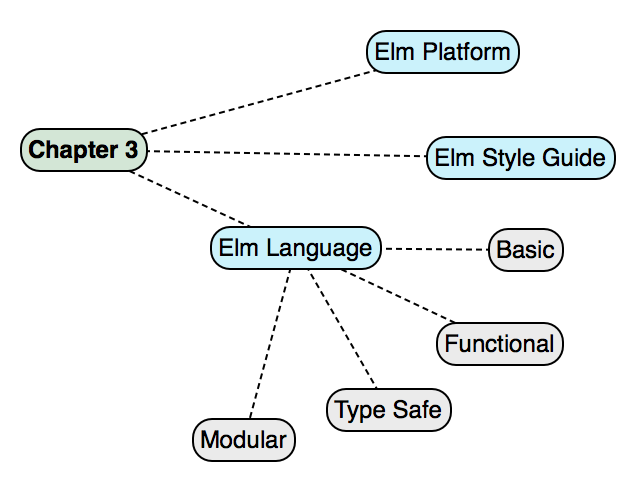
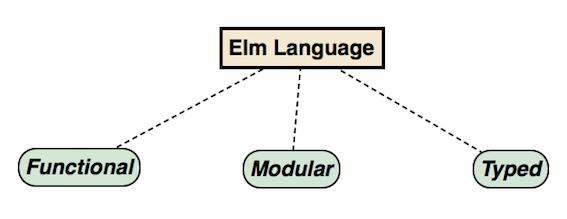

[ToC](https://github.com/kujua/webapplications-with-elm-beta-access/blob/master/Readme.md)

# *Chapter 3 - Elm Primer*

In the first chapter we have seen several Elm application examples. We did not go into details of the implementations and studying Elm code without knowledge of the language is certainly overwhelming. This chapter provides a deeper look into Elm and Appendix A gives an overview of the Elm syntax. The goal is that after reading this primer, you can then go back to the source code of the examples in the first chapter and understand more what is going on in the implementation of the examples. This chapter is all about the language and the organization of a project, we will look at libraries and tools in Chapter 4.



Figure 3-1. Chapter Overview

I recommend to read this chapter in sequence, because the language explanations are building up from easier features to more advanced feature.

# Elm Platform

Elm is not only a language, but a platform to create web applications. It has tools and a runtime which is necessary to run an Elm application derived from Elm code. When we compile even a small application like the *Hello-World* example in Chapter 2, the Elm compiler creates a JavaScript file with the code of the application, but it also integrates needed runtime functions and any other library code that is used, for example the Html package that has amongst others a function *text* to display text on a web page.

**Tip** The Elm platform is written in Haskell with occasional client implementations in Elm . All source code can be found on GitHub^[https://github.com/elm-lang]. In Appendix C we have a closer look at this source code. It is not necessary to understand the Haskell code, but it may be of interest to see what is behind the Elm platform surface.

We have already encountered *elm-make* in Chapter 2 when we created a simple *Hello-World* program. When we run the command <span custom-style="Code Inline">elm make</span> it will call internally *elm-make* to create an executable form of a project. Executable in this context means a JavaScript file that can be interpreted by a JavaScript engine.

As the name *make* suggest the tool does more than just compiling. It also checks the validity of the configurations in *elm-package.json* and the status of packages. With several command line arguments available *elm make* can be configured at runtime for various scenarios. We will look at this tool more in Chapter 4.

The following overview lists the other tools of the Elm platform that help with the development process:

* *elm-package* - This is Elm's package manager similar to *npm*. The Elm platform maintains a package repository^[http://package.elm-lang.org/]. At the moment the tool can't handle local packages, which is one of the reasons that packages can be found that are out of date or unfinished. This will hopefully change in future. In the meantime there are workarounds available to trick Elm into believing that a package was downloaded by manipulation files in the directory *elm-stuff*. We have a look at this in Chapter 4. Overall, the package manager works as expected and handles version problems well. For example, if there is no version of a package matching the used Elm language version, elm-package will throw an error.
* *elm-reactor* - This is an interactive web application that can run and compile Elm code. It has debug options that changed over time and we will see more of it in Chapter 4. During development it is not necessary to run the elm-rector, because the compiled code is just JavaScript which can be embedded in any html page and run on any local server or even in the browser if run in a way that restrictions do not kick in.
* *elm-repl* - This is the *read–eval–print loop* tools that allows interactive programming. It is perfect for trying small examples and has some configuration options which we will investigate in Chapter 4.

# Elm Style Guide

The creator of Elm is very clear about how he envisions Elm code to be written. It may not be what you are used to from other languages or would like yourself, but a consistent coding style makes it easier to read code from somebody else or maintain code later. To make this task easier we want to format our code during writing it without thinking too much of the intricacies of the formatting rules. The style guide can be found on the Elm website^[http://elm-lang.org/docs/style-guide] and discussions about it can be found in the Google group *Elm Discuss*^[https://groups.google.com/forum/#!forum/elm-discuss].

Some editors with Elm plugins as discussed in Chapter 2 may have code formatting already built in. Most of them rely on *elm-format*^[https://github.com/avh4/elm-format] which can also be run from the command line. If you don't want the integration in an editor, you can install *elm-format* locally in a project. The plugins can format the code when saving or on demand, but not all most common editors support all options. The *elm-format* Github website has a table with information about editor integrations and install instructions.

The formatting tool is in *alpha* and at the time of writing (December 2016) there are issues open that may make the formatting fail or format a way you don't want it. When you find an issue, just report it - there are many contributors working on this project and most probably the issue will be resolved in the next release. The tool can be built from source as well, but you will need to have a working Haskell installation on your computer. See Appendix C for setting this up.

**Tip** By default, the tool overwrites the source code file, so be careful and check the formatted output or invoke it with the option *--output FILE*. the argument *FILE* gives the name of a file the formatted code should be written to. Another useful option is *--elm-version VERSION* to define the version of the platform the code file is supposed to support. there is also the option *--stdin* which reads from the stdin device and outputs on the stdout device.

Have a look at the following Elm code. It is not formatted in a particular way, but rather written in a way developers coming from other languages may prefer or they simply have their own individual style. The code in the listing compiles, but does not make much sense, for example the functions *update* and *view* are not hit. This example's sole purpose is to show formatting for different language features.

We run *elm-format* in a shell with the command <span custom-style="Code Inline">elm-format main.elm</span>, assuming that our code file is saved in the current directory, has the name *main.elm* and *elm-format* was installed globally:

###### Listing 3.1 Non-formatted source code

```{.elm .numberLines}
module Hello exposing (..)
import Html exposing (div, input, text, form, button)
import Html.Events exposing (onClick, onInput)
import String

type Msg = Change String | Check | Suggest (List String)

main =
  text "Hello World"

update msg model =
  case msg of
    Change m -> ( m, Cmd.none )
    _ -> ("", Cmd.none)

view model =
  div [][ input [ onInput Change ] [],
    button [ onClick Check ] [ text "Check" ],
    div [] [ text (String.join ", " model.suggestions) ]
  ]

```

The formatting tool will run and - in our case - overwrites *main.elm* with the formatted version. To create a file without overwriting the original file we could invoke the command <span custom-style="Code Inline">elm-format main.elm --output formatted.elm</span>. This will create the file *formatted.elm* in the current directory.

Let's have a look at the formatted file:

###### Listing 3.2 Formatted source code

```{.elm .numberLines}
module Hello exposing (..)

import Html exposing (div, input, text, form, button)
import Html.Events exposing (onClick, onInput)
import String


type Msg
    = Change String
    | Check
    | Suggest (List String)


main =
    text "Hello World"


update msg model =
    case msg of
        Change m ->
            ( m, Cmd.none )

        _ ->
            ( "", Cmd.none )


view model =
    div []
        [ input [ onInput Change ] []
        , button [ onClick Check ] [ text "Check" ]
        , div [] [ text (String.join ", " model.suggestions) ]
        ]

```

Immediately we notice that the line number has increased by 50%. Between declarations are two empty lines, also statements in the *case* expression are separated by one empty line. The most controversial rule of guideline is the formatting of the function *view*. The *leading comma* style is unusual for developers coming from C#, Java or even JavaScript, although there are discussions in the Node.js and Javascript community to introduce this style. For Haskell developers this style is not unusual and is used to separate list and similar items.

Elm's style rules are based on easier maintenance, easy readability and clean diffs. In this book we adhere to the style guide except for additional empty lines to keep the code compact for easier reading.

# Elm Language

Elm as a language can be seen from different angles. The main purpose of the language and the platform is to create web applications. Elm is not a general purpose language and as we will see in Chapter 7 it is difficult and sometimes impossible to break out of the web constraints. In general, we can define Elm like this:



Figure 3-2. Elm Language

Elm is a functional, typed and modular language. In addition to these points, Elm has basic features like other languages that make it possible to write expressions or control the program flow. Some parts of the language as discussed here are defined in Haskell code to define the structure of the language. Other parts are written in Elm itself and can be found in the core library^[https://github.com/elm-lang/core]. Additional types and functionality is in library modules that can be imported as needed. The core library is automatically loaded and part of the JavaScript runtime that is created during compilation.

*Chapters 4* and *6* offers a deeper look into libraries that come with the Elm platform.

**Note** This chapter is based on Elm version 0.18 which introduced a few breaking changes. Example code on web sites or blog posts can be outdated if not updated to the latest version and the syntax may differ from the examples in this book.

In the following pages we use the above classification - functional, modular, typed - to give an overview of the language.

## Basic language features

The basic language features in Elm provide ways to express operations on values with operators and control how these expressions are integrated in the statement flow of an implementation.

### Operators

The Elm language provides operators we are used from other languages. It also has some more unconventional, at least if you are not familiar with Haskell.

#### Arithmetic Operators

*Arithmetic* operators work with numeric values and return a numeric value. They are all binary and take two operands.

###### Listing 3.3 Arithmetic Operators

```{.elm .numberLines}
> 1.0 + 2      -- addition
  3 : Float
> 2 - 1.0      -- subtraction
  1 : Float
> 1 * 3.1 * 2  -- multiplication
  6.2 : Float
> 6.0 / 2      -- floating point division
  3 : Float
> 4 / 2        -- floating point division
  2 : Float
> 3 // 2       -- integer division
  1 : Int
> 2 ^ 8        -- exponentiation
  256 : number
> 3 % 2        -- modulo
  1 : Int

```

The arithmetic operators take either integer or float, except for the specialized division operators for float and integer and the modulo operator that only makes sense with integer values.

The floating point division will always return a float value, no matter which type the operands now. The integer division discards the remainder as expected, but the similarity of the operators may lead to unexpected behavior if the developer is not careful.

#### Bitwise Operators

*Bitwise* operators take two integer values and return an integer value.

###### Listing 3.4 Bitwise Operators

```{.elm .numberLines}
> import Bitwise exposing (..)
> and 255 128  -- bitwise and
  128 : Int
> or 255 128   -- bitwise or
  255 : Int
> Bitwise.xor 255 128  -- bitwise xor
  127 : Int

```


The calling of bitwise operators is different than we have seen with the arithmetic operator examples. They are both functions, but one is called *infix*, the other one *prefix*. We will look at the differences and declaration options for each later in this chapter.

If you try the examples in *elm-repl* you have to import the module *Bitwise* first. Still, the operator *xor* has a name conflict with a function of the same name in the module *Basics*, so we have to call *xor* fully qualified with the module name prefixed.

#### Logical Operators

*Logical* operators take two boolean arguments and return a boolean result.

###### Listing 3.5 Logical Operators

```{.elm .numberLines}
> p1 = Calzone
  Calzone : AllBasics.Pizza
> p2 = Margherita
  Margherita : AllBasics.Pizza

> p1 == QuattroStagione && p2 == Margherita
  False : Bool
> p1 == Calzone && p2 == Margherita
  True : Bool
> p1 == QuattroStagione || p2 == Margherita
  True : Bool
> p1 == Calzone || p2 == Margherita
  True : Bool
> not (p1 == Calzone) && p2 == Margherita
  False : Bool
> not (p1 == Calzone) || p2 == Margherita
  True : Bool

```

These operators should not be mixed up with the bitwise operators, especially coming from other languages where for example the word *and* is used for logical comparisons.

#### Comparison Operators

*Comparison* operators take to *comparable* types and returns a boolean value. We will discuss *comparable* types later in this chapter. Basically they are standard number and string types on their own or in lists and tuples.

###### Listing 3.6 Comparison Operators

```{.elm .numberLines}
> p1 = "Calzone"
  "Calzone" : String
> p2 = "Margherita"
  "Margherita" : String

> p1 == "Calzone"
  True : Bool
> p1 /= "Calzone"
  False : Bool
> p1 < p2
  True : Bool
> p1 <= p2
  True : Bool
> p1 > p2
  False : Bool
> p1 >= p2
  False : Bool

```

Comparisons work as known from other languages. The notion of *comparable* in elm is not yet fixed, so it may be possible that custom types can be made comparable in future.

#### Functional Operators

*Functional* operators will become relevant when we discuss functions. They are used to pipe or compose functions. The following listing defines two functions for multiplying and adding numbers. We want to combine calls of these functions for given arguments and use *pipe operators*.

###### Listing 3.7 Pipe Operators

```{.elm .numberLines}
-- AllBasics
addNumbers : List number -> number
addNumbers list =
  List.foldr (+) 0 list

multiplyNumbers : number -> number -> number
multiplyNumbers value multiplicator =
  value * multiplicator

-- elm-repl
import AllBasics exposing (..)
> addNumbers [1,2] |> multiplyNumbers 3
  9 : number
> multiplyNumbers 3 <| addNumbers [1,2]
  9 : number

```

The first example uses the forwarding pipe operator. First we calculate the addition - in our example adding number items of a list - and the we pass the result to the function *multiplyNumbers*  as first argument. The functions will be evaluated from left to right.

The second example in the listing does the same, but with the backward pipe operator the functions will be evaluated from right to left. The usage of any of these operators lead to the same result.

*Composition operators* work in a different way, but achieve similar results.

###### Listing 3.8 Composition Operators

```{.elm .numberLines}
-- allbasics.elm
addNumbers : List number -> number
addNumbers list =
  List.foldr (+) 0 list

multiplyNumbers : number -> number -> number
multiplyNumbers value multiplicator =
  value * multiplicator

-- elm-repl
> fleft = addNumbers >> multiplyNumbers
  <function:_user$project$Repl$fleft> : List number -> number -> number
> fleft [1,2,3] 2
  12 : number
> fright = multiplyNumbers << addNumbers
  <function:_user$project$Repl$fright> : List number -> number -> number
> fright [1,2,3] 2
  12 : number

```

The type annotations give a hint of what is happening. The original function *addNumbers* takes a list of numbers and returns a number. The original function *multiplyNumbers* takes two numbers and returns the result as number.

When we use the composition operators >> or << we *compose* a new function that takes a list of numbers and another number as multiplicator and delivers the result as number.

#### Special Operators

Another operator is the *concatenation operator ::*. It's purpose is to add elements to a list.


###### Listing 3.9 Concatenation

```{.elm .numberLines}
type Pizza = Calzone | Margherita | QuattroStagione

addPizza : List Pizza -> Pizza -> List Pizza
addPizza l p =
  p :: l

firstPizza : List Pizza -> Maybe Pizza
firstPizza l =
  case l of
    head :: tail ->
      Just head
    [] -> Nothing

> firstPizza []
  Nothing : Maybe.Maybe AllBasics.Pizza
> firstPizza <| addPizza [Margherita] Calzone
  Just Calzone : Maybe.Maybe AllBasics.Pizza
> firstPizza [Margherita]
  Just Margherita : Maybe.Maybe AllBasics.Pizza

```

The function *addPizza* takes a list and an element and adds it as first element. With the piping operator we can then send the resulting list to the function *firstPizza*. It uses *Maybe* - which we will discuss in *Chapter 5* - to return either *Nothing* in case the list is empty or the first element of the list.

The *::* in the case expression is pattern matching the list argument. If there is at least one element, *head* will return this element, *tail* is the rest of the list, but can also be empty if there is only one element.

The operator *++* concatenates two arguments if they are *appendable* - see later in the chapter when we discuss types what *appendable* in Elm means.

###### Listing 3.10 Add to List

```{.elm .numberLines}
addPizzaOrdered : List Pizza -> List Pizza -> List Pizza
addPizzaOrdered l p =
  l ++ p

> addPizzaOrdered [Margherita] [Calzone]
  [Margherita,Calzone] : List AllBasics.Pizza

```

The function *addPizzaOrdered* simply adds two lists in this example.

### Control Structures

We need some structures to control the flow of statements in functions. In fact, there are only three control structures. You may miss *for* or *while*. As in other functional languages these are expressed with recursive functions.

#### If

The *if* statement takes expressions that return a boolean value and branches into statements depending on that value. These expressions can only evaluate to *True* or *False*, Elm does not have the notion of "truthiness"^[https://en.wikipedia.org/wiki/Truthiness].

###### Listing 3.11 If

```{.elm .numberLines}
type Pizza = Calzone | Margherita | QuattroStagione

choosePizzaIf : Pizza -> String
choosePizzaIf p =
  if p == Calzone then
    "Pizza chosen: " ++ toString p
  else if p == Margherita then
    "Pizza chosen: " ++ toString p
  else
    "We don't serve this pizza"

```

This example has three branches and prints out the argument value. We see here the *++* operator again which is used to concatenate to strings.

We have a final *else* branch which looks to be unnecessary. Let's omit it and then compile again.

###### Listing 3.12 If without else

```{.elm .numberLines}
choosePizzaIf p =
  if p == Calzone then
    "Pizza chosen: " ++ toString p
  else if p == Margherita then
    "Pizza chosen: " ++ toString p

```

To our surprise we get an error. Normally Elm compiler messages are quite useful, but in this case it it not clear at first glance what is needed. The clue lies in the phrase *You are missing some stuff*. It is the *else* branch that is needed. Every *if* needs an *else*.


###### Listing 3.13 If - Syntax Error

```{.numberLines}
-- SYNTAX PROBLEM ---------------------------------------------- allbasics.elm

I need whitespace, but got stuck on what looks like a new declaration. You are
either missing some stuff in the declaration above or just need to add some
spaces here:
I am looking for one of the following things:
    whitespace
Detected errors in 1 module.

```

The *if* control structure is not so much used in normal named functions, but more in anonymous functions. We will see examples of this throughout the book.

#### Case

The *case* statement is the bread-and-butter of programming in Elm and other functional languages. It relies on pattern matching to determine which expression to evaluate.

The following example does exactly the same what the first *if* example above does.

###### Listing 3.14 Case

```{.elm .numberLines}
type Pizza = Calzone | Margherita | QuattroStagione

choosePizza : Pizza -> String
choosePizza p =
  case p of
    Calzone
      -> "Pizza chosen: " ++ toString p
    Margherita
      -> "Pizza chosen: " ++ toString p
    _
      ->  "We don't serve this pizza"

```

We also see that all possible patterns need to be covered, similar to *if-else*. If we do not provide the last pattern with the underscore *_* the compiler will complaint. The underscore is a wildcard in this case and means that all other patterns should match this condition.

The *case* structure is used in many examples of this book and we will encounter it often.

#### Let-In

The *Let-In* structure can be compared to assignment statements. The following - very simple - function returns a tuple.

###### Listing 3.15 Let-In

```{.elm .numberLines}
type Pizza = Calzone | Margherita | QuattroStagione

pizzaOrders : ( Pizza, number )
pizzaOrders =
    let
      p = Calzone
      n = 5
    in
      (p,n)

```

The values for the returned tuple are calculated in the function. The *let* is like a block for defining local variables that can then be used in *in*.

**Note** As the other structures discussed in this chapter, *let..in* is an expression and can be used in any place expressions are allowed. In Elm we use a programming style that constructs bigger expressions from smaller expressions. Almost every functions is then built from a big expression. Exceptions are, for example, constant functions.

### Prefix and Infix Operators

We have seen in the section about operators, that some of them can be called like we are used to use operators in mathematics. Others have to be called like a function.

They are both functions, of course, but they are implemented in a different way. For example, the arithmetic operator *+*:

###### Listing 3.16 Arithmetic operator +

```{.elm .numberLines}
-- Basics.elm
(+) : number -> number -> number
(+) =
  Native.Basics.add

```

We see that the function is declared as *(+)*. This means that it can be used with an infix call, but can also be called as a normal function.

###### Listing 3.17 Call Arithmetic operator +

```{.elm .numberLines}
> 1 + 2.0     -- infix
  3 : Float
> (+) 1 2.0   -- prefix
  3 : Float

```

First, we call the + operator as infix operator. Then we call + in a prefix way. The function name is *(+)* in this case, the arguments are passed after the name and the result is the same as in the infix case.

**Note** The use of infix operators with this syntax comes from Haskell. You can read more about the pros and cons in the Haskell wiki^[https://wiki.haskell.org/Use_of_infix_operators].

We can define our own infix functions as well. It is not recommended to define new operators for public packages, but it is possible:

###### Listing 3.18 New infix operator

```{.elm .numberLines}
(++*) : List number -> number -> number
(++*) l m =
  case l of
    [] -> 0
    _ -> List.foldr (+) 0 l * m

```

This cryptic looking function takes a list of numbers and a multiplicator. It then calls <span custom-style="Code Inline">List.foldr (+) 0 l</span> which adds all the numbers in the list. The result will be multiplied by the multiplicator. The first line is a type annotation and we will look at this a little bit later in this chapter. In *Chapter 4* we look at library modules like *List*.

We can call our new operator in two ways as we did with the + operator:

###### Listing 3.19 Call new infix operator

```{.elm .numberLines}
> import AllBasics exposing (..)
> (++*) [1,2] 3
9 : number
> [1,2] ++* 3
9 : number

```

Both calls work as expected and yield the same result with the same arguments. The import on the first line is necessary to tell *elm-repl* where the new operator is defined. The module *AllBasics* is in the source code in the directory *Basics*.

**Note** In previous versions of Elm it was possible to use backticks to call any binary function infix, for example <span custom-style="Code Inline">1 `anybinfunc` 2</span>. This functionality was replaced by using other operators or making an ordinary function call.

[...]

# What we learned

This chapter had a lot of information in it:

* We saw what the Elm platform offers us.
* We looked at code adhering to the Elm style guide.
* We learned the basics of the Elm language from different point of views: functional, typed and modular.

In the next chapter we will examine the tools available on the Elm Platform and have a look at some of the basic standard libraries.
