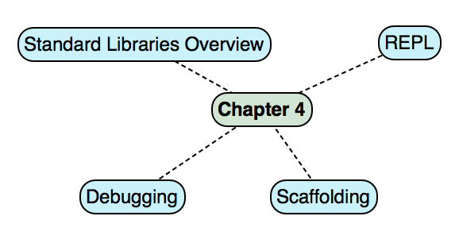
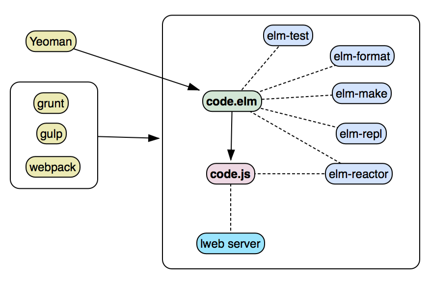
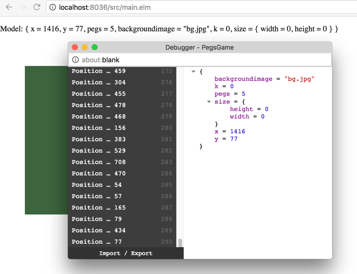
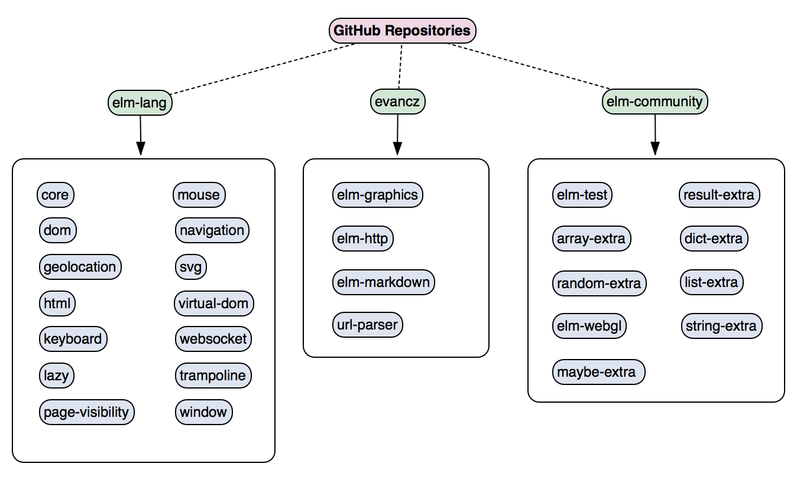

[ToC](https://github.com/kujua/webapplications-with-elm-beta-access/blob/master/Readme.md)

# *Chapter 4 - Tooling and Libraries*

# Tooling and Standard Libraries

In the last two chapters we have set up our development environment and learnt the basics of the Elm language. Now we want explore the tooling the Elm platform provides and get an overview of standard libraries.



Figure 4-1. Chapter Overview

This chapter covers the following topics:

* We answer the question how to test small code snippets with the REPl.
* We look at ways to get a head-start into a project with scaffolding.
* We explore how we can build our project..
* We look at an overview of standard libraries that come with the Elm platform.

# REPL

It seems that any platform needs to have a REPL (*read-eval-print-loop*) nowadays, otherwise it is not taken seriously. It is certainly a matter of preference, if a developer uses a REPL or not. This tool is very useful to explore the language and standard or third party libraries.

In the last two chapters we have already used the Elm REPL to learn aspects of the language. Now we want to explore more options and use cases.

We can start *elm-repl* it the *elm* command:

###### Listing 4.1 Elm REPL

```{.numberLines}
$ elm repl
---- elm-repl 0.18.0 -----------------------------------------------------------
 :help for help, :exit to exit, more at <https://github.com/elm-lang/elm-repl>
--------------------------------------------------------------------------------
_

```

We see a banner with version information and a hint about two commands we can use from within *elm-repl* to get help or exit *elm-repl*. The prompt in the last line is indicating that the REPL is ready to receive commands. If we type in the command *:help*, we see the following:

###### Listing 4.2 Elm REPL Help

```{.numberLines}
> :help
General usage directions: <https://github.com/elm-lang/elm-repl#elm-repl>
Additional commands available from the prompt:

  :help                 List available commands
  :flags                Manipulate flags sent to elm compiler
  :reset                Clears all previous imports
  :exit                 Exits elm-repl

```

The command *:flags* can be used to manipulate compiler flags in the REPL. In version 0.18 there is only one flag allowed (*--src-dir*). This directory can be used for source code we use in the REPL, otherwise it just uses the project directory we are starting *elm-repl* from and uses its *elm-project.json*.

So what can we do with *elm-repl*? We can use expressions with operators we have discussed in chapter 3, we can define functions and types and we can import modules.

The following expressions look familiar from *Chapter 3* where we used similar expressions learning the language.

###### Listing 4.3 Elm REPL - Expressions

```{.elm .numberLines}
> s1 = "hello world"
  "hello world" : String
> l1 = List.range 1 4
  [1,2,3,4] : List Int
> s2 = s1 ++ " " ++ toString pi
  "hello world 3.141592653589793" : String
> 42 + pi - 1
  44.1415926535898 : Float

```

All the above examples can be typed into *elm-repl* without importing additional modules. Some functions and modules are part of *elm-core* and are automatically imported and immediately available - see later in this chapter which modules and functions are available from the start.

We can also define functions and union types in *elm-repl*:

###### Listing 4.4 Elm REPL - Functions

```{.elm .numberLines}
> multiplyNumbers value multiplicator = value * multiplicator
  <function> : number -> number -> number
> returnOnly42 = 42
  42 : number
> multiplyNumbers returnOnly42 42
  1764 : number

```

###### Listing 4.5 Elm REPL - Types

```{.elm .numberLines}> type Pizza = Calzone | Margherita
> type alias Pos = { x:Int, y:Int}

```

The usage of the REPL gets a little bit more complicated if several modules are defined as dependencies. What happens if we want to use a function that is unknown to *elm-repl*? In the following example we want to get the length of a string.

###### Listing 4.6 Elm REPL - Length of String

```{.numberLines}
> length "string"
-- NAMING ERROR ---------------------------------------------- repl-temp-000.elm
Cannot find variable `length`
3|   length "string"
     ^^^^^^
Maybe you want one of the following?
    List.length

> String.length "string"
-- NAMING ERROR ---------------------------------------------- repl-temp-000.elm
Cannot find variable `String.length`.
3|   String.length "string"
     ^^^^^^^^^^^^^
No module called `String` has been imported.
> import String
> String.length "string"
  6 : Int

```

The compiler does not know exactly what we want, but the hints give us the impression there may be a *String.length* available, although *List.length* is suggested. Eventually we get the correct hint to import a module. We do so and the expression is finally working.

When we type an expression in *elm-repl* or import a module the source code is implemented into a temporary module. We can import our own modules and change it while *elm-repl* is running. It will pick up the changes and recompile.

Not all features of the language are available in *elm-repl*. For example, it does not understand *Type Annotations* and definitions of operators did not work in the Elm platform version I used for this book as well:

###### Listing 4.7 Elm REPL - Type Annotation

```{.numberLines}

> f : Int -> Int \
| f n = n
-- SYNTAX PROBLEM -------------------------------------------- repl-temp-000.elm

A single colon is for type annotations. Maybe you want :: instead? Or maybe you
are defining a type annotation, but there is whitespace before it?
5|   f : Int -> Int
Maybe <http://elm-lang.org/docs/syntax> can help you figure it out.

> f n = n
<function:_user$project$Repl$f> : a -> a

```

The compiler detects that a type annotation is intended, but can't resolve what we write. The backlash at the end of the line tells *elm-repl* that we want to type in multiple lines and the text should only be evaluated once we press enter without a backlash at the end of the line.

Defining function in the REPL is working and we will get a type annotation returned. The lack of being able to evaluate type annotations is not a problem unless we have or want to specify exactly what types we expect as arguments.

###### Listing 4.8 Elm REPL - Operator

```{.numberLines}
> (++*) list multiplicator = 42

-- SYNTAX PROBLEM -------------------------------------------- repl-temp-000.elm
I ran into something unexpected when parsing your code!
5|   ++*
     ^
I am looking for one of the following things:
    an expression
    whitespace

```

This operator definition is an abbreviated example from *allbasics.elm*. It seems that *elm-repl* does not recognize the parentheses and throws an error. This and the above problem may be fixed in the version you are using.

We have seen a multiline example above. The following code defines a function over several lines that can be called I the REPL from that point on. This function definition is local to *elm-repl* and is lost when exiting with *:exit*.

###### Listing 4.9 Elm REPL - Multiline

```{.numberLines}
> varassign_to_tuple = \
|   let \
|     s1 = "hello world" \
|     s2 = 42 \
|   in \
|     (s1,s2)

("hello world",42) : ( String, number )

```

The REPL - as is the language - is very picky with whitespace. For example, in the above code the *let* and *in* need to be aligned on the same column and indented. This is not a big problem in an editor, but makes typing in longer functions in *elm-repl* cumbersome.

Overall, Elm's REPL is sufficient for testing expressions or small functions. It is more powerful when we import our modules to test some of our functions manually. This is the approach we have done in the previous chapters to learn Elm. Once we apply the Elm architecture and build web applications the REPL is not a good way to test anymore.

In any case, *elm-repl* is not a replacement - and is not meant - for in-depth testing. It's a tool for trying out ideas or getting to know the functions of a module that may be used in an application. It serves well up to a point in the development process.

# Development Process

Developing an Elm application involves several tools from the Elm platform and beyond.



Figure 4-2. Elm Development Process

In the center of the process are the Elm code files. In the diagram we have only one file displayed, but every non-trivial application will have more than one. We will touch code organization in *Chapter 5*.

The code files are compiled with *elm-make* and manually tested in *elm-repl* and *elm-reactor*. We format the code with *elm-format* and run unit tests with *elm-test*. The output of the compilation is a JavaScript file that can be run in a web server.

On the left side of the diagram we see tools listed that are supporting this process. What many of them - and all in the diagram - have in common is that they are Nodejs tools which emphasizes the integration of the Elm platform into that eco system. The next two sections have more information about those tools.

## Scaffolding

When we start a project we may want to get a head start with pre-built project skeletons, that support building the projects and debugging them. The Elm platform does not provide a scaffolding tool. Simple applications are not too difficult to set up, but if we want a little bit more than we have to organize our code better than having everything in one file or even one directory.

Searching for Elm scaffolding solutions reveal several attempts by the Elm community to bootstrap a project. Some are written in Python, some in Haskell and many in JavaScript.

One of the most used scaffolding tools for web applications is *Yeoman*^[http://yeoman.io/].  The tool itself is a framework for generators - at the moment there are more than 5000 generators in the database. Not all are updated regularly and won't work with the latest versions of frameworks, but the rest is still an impressive number.

We can find a few Elm generators, but none of them was updated to handle the latest version. Nevertheless, let's try one and go through the process of setting up a new project. I assume you have set up *Yeoman* on your computer.

###### Listing 4.10 Scaffolding

```{.numberLines}
$ npm install generator-elm
$ yo elm .

     _-----_
    |       |    ╭──────────────────────────╮
    |--(o)--|    │    Welcome to the Elm    │
   `---------´   │        generator!        │
    ( _´U`_ )    ╰──────────────────────────╯
    /___A___\   /
     |  ~  |
   __'.___.'__
 ´   `  |° ´ Y `

Going to create project in folder: ~/Projects/bookcompanion-elm/Scaffolding
? Project name? Scaffolding
? Want to use Twitter Bootstrap 3.x? No
? Want to install any additional packages? (space delimited)
>
   create
    (omitted)
===============================================================
  Project generated

  Check out the generated README.md for usage information.

  Quick-start: npm start and visit <http://localhost:8080>.
===============================================================

```

The installation of the generator takes a while and installs several Node packages in the Yeoman folder. Generating a new project goes through downloading about 120 MB of Node packages and then compiles the project. Options for scaffolding are not too many, the option values in the listing above are the default values.

This generator uses *webpack* to build the application. It provides all necessary scripts in *package.json* and also sets up the configuration file *webpack.config.js*. A readme file explains the steps to build and run the application. The provided code file is a simple "Hello World" example which implements all part of the Elm architecture in one file.

**Tip** Having not found the right scaffolding solution I decided to write my own Yeoman generator. It is updated for the latest versions and has many configuration options to tailor the generator to the needs of a project. See kujua-elm^[https://github.com/kujua/kujua-elm].

Most of the time scaffolding solutions are opinionated and force the user to use certain tools. The concepts come from JavaScript development and use its tools. In this section we created a project that uses *webpack^ for building, the next section looks at other solutions.

## Building

When we develop an Elm application we want to automate as much as possible:

* Compile changed files automatically.
* Build distribution files.
* Invoke tools easily.
* Run a web server with the compiled files.
* Support JavaScript frameworks and CSS creation

Luckily we can use the same tools the JavaScript web community has created. Apart from *Webpack*^[https://webpack.github.io/] mentioned in the last section, we also have Gulp^[https://www.npmjs.com/package/gulp-elm] and Grunt^[https://www.npmjs.com/package/grunt-elm] available.

All the above mentioned tools require configurations and use many other Node packages to do its job. If you just want to watch Elm files and compile them when changed, a more lightweight solution would be Chokidar^[https://github.com/paulmillr/chokidar] and Chokidar-cli^[https://github.com/kimmobrunfeldt/chokidar-cli]. The following script can be integrated into the *scripts* section in *package.json*.

###### Listing 4.11 Watch

```{.numberLines}
"watch": "chokidar '**/*.elm' -c 'elm make allbasics.elm
    --output elm.js --warn' --initial"

```

Whenever a file changes the main file *allbasics.elm* and dependent files will be compiled with the *--warn* option. The tool has many more options and is used by other build tool like the aforementioned *Gulp* or *Webpack*.

This is not the place to go much deeper into configuration of the different build tools. A development team will use what they are comfortable with. Build tools together with scaffolding and editor plugins working together are the key to successfully implement Elm applications that are bigger than a simple "Hello World".


## Switch Elm versions

At the moment there is no solution to switch versions of the Elm platform. Especially the rapid development of Elm makes it necessary to have different projects use different Elm platform versions.

There are workarounds with local and global installations as described in *Chapter 2*. As the name says, they are workarounds and it would be nice to have a switch tool as we know from other languages,


# Debugging

The Elm platform prides itself of having no runtime errors because of the language design and application compilation. At least this is the information we get from companies that have actually used Elm in production.

Sometimes we want to know what is going on in our application when we run it in a browser. The Elm platform is still working what the best solution would be to achieve debugging of a reactive application in the browser. There were solutions before^[http://debug.elm-lang.org/] which are on hold now.

One way rot "look" into an application is to print information out. We did this decades ago and the method is still used, for example in JavaScript. Functional languages like Elm and asynchronous programs don't lend themselves easily to employ this. Therefore we find in the Elm core libraries the module *Debug*, but the warning is not to use it in production.

The first function in the following example - *debuggerTestString* - uses *log* to print out debug information on the console. From the perspective of functional programming this is not a pure functions and it is a side effect. The second function - *debuggerTestCrash* - crashes the application with a custom message.

###### Listing 4.12 Debug  - Code

```{.elm .numberLines}
import Debug exposing (..)

debuggerTestString : String -> Int
debuggerTestString s =
  length (log "s" s)

debuggerTestCrash =
  crash "Not implemented"

```

When we run these functions in *elm-repl* we get the following output:

###### Listing 4.13 Debug  - Output

```{.numberLines}
> debuggerTestString "Hello"
  s: "Hello"
  5 : Int
> debuggerTestCrash
  Error: Ran into a `Debug.crash` in module `AllBasics` on line 11
  The message provided by the code author is:
      Not implemented

```

Printing out debug information is not always possible. When we run the application in the browser we need a direct look into the state of the application. The following screen shot is from a test page of the game framework we saw in *Chapter 1*. The line at the top of the page displays the state whenever the values are updated. Updates are triggered when the mouse position changes.

The overlay window titled *Debugger* shows the state changes as well. The difference is that we can export all the states to a file and import one for later uses to bring the application into an exact state we want to show - perhaps an error state. We can also click on one state change and resume from there.



Figure 4-3. Elm Reactor Debugger

Debugging of Elm applications is not easy. We hope to get more tools in the future as the Elm platform evolves.

# Standard Libraries

A programming language is only one part of a platform. Without tools as described above and libraries  it is very difficult if not impossible to create applications in a productive way. The Elm platform is geared towards web applications, so it is no surprise that many packages coming together with the Elm language are handling exactly this task.

This section is titled *Standard Libraries", so a developer coming from other languages may think that there is one module that includes what may be called a standard library. Due to the platform being in development, there are a few places to look for.

The following diagram has an overview of packages which I am considering to constitute together a first version of the Elm standard library:



Figure 4-4. Elm Standard Library

There are more packages	in the mentioned repositories, the diagram only shows the most important and also regularly updated packages. Some of the packages from other repositories might transit into the *official* elm-lang repository in later Elm platform versions.

The following packages are imported by default, therefore no implicit *import* statement is necessary.

###### Listing 4.14 Default Packages

```{.elm .numberLines}
import Basics exposing (..)
import Debug
import List exposing ( List, (::) )
import Maybe exposing ( Maybe( Just, Nothing ) )
import Result exposing ( Result( Ok, Err ) )
import Platform exposing ( Program )
import Platform.Cmd exposing ( Cmd, (!) )
import Platform.Sub exposing ( Sub )

```

Not all functions of imported modules are exposed. For example, *List* only exposes the constructor and the concatenation operator ::.

In the following section we have a deeper look into packages that deal with data structures.. The rest and other packages from different repositories will be explained in *Chapter 5*.


# What we learned

This short chapter gave us an overview of the built-in REPL and we looked at the development process and the tools in the Elm platform to support us. The overview of library packages is making us curious to see the functions of those libraries in action.

Before this we need to learn the Elm Architecture in the next chapter.
